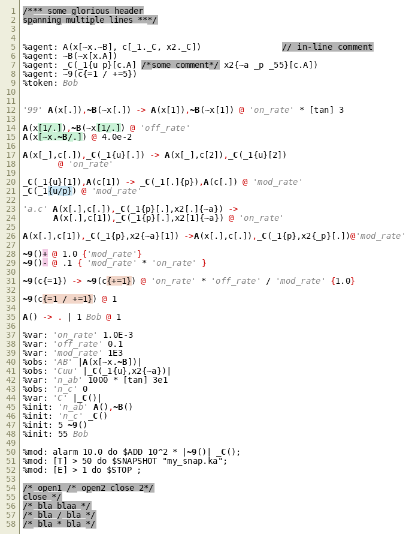
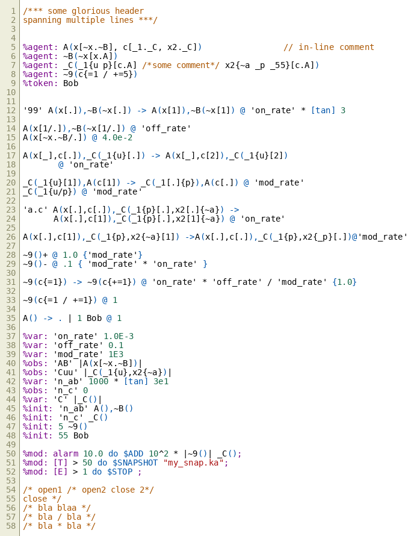
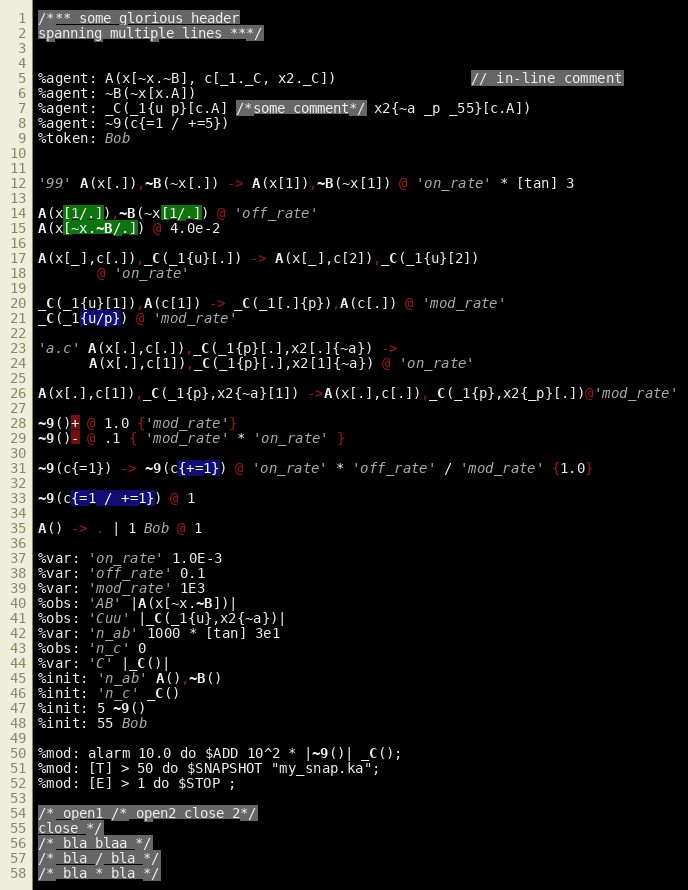
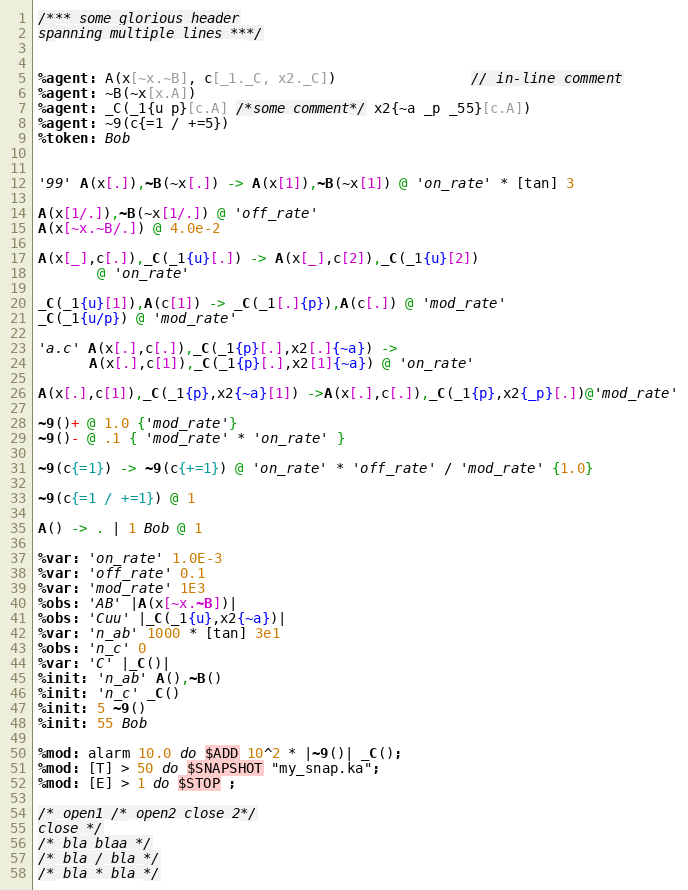
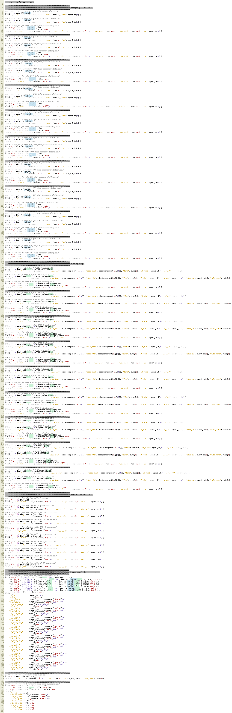
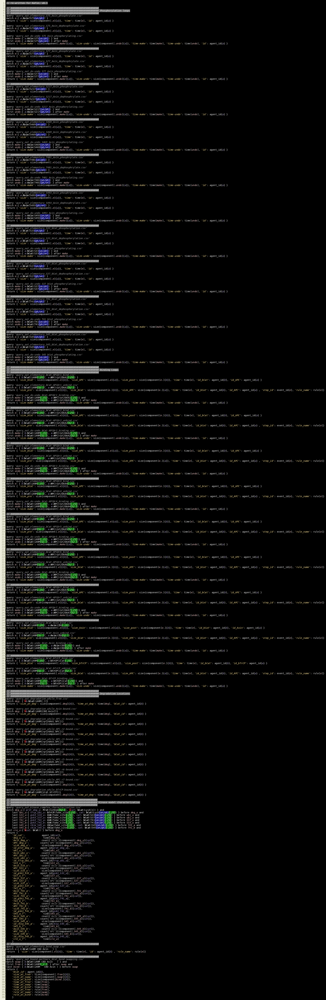

# Pygments Kappa plugins

## About
Two plugins for the [Pygments package](https://pygments.org/) adding lexing and styling support for the [Kappa language](https://kappalanguage.org/), and the related [Kappa Trace Inquiry engine](https://github.com/jonathan-laurent/KaTie) (KaTIE).



### Installation
The plugin uses `setuptools` "entry points" to extend the lexers and styles known to Pygments. It thus works on a stock Pygments installation. To install directly from GitHub[^1]:

`pip install git+https://github.com/hmedina/Pygments_Kappa_plugin.git#egg=Pygments_Kappa_plugin`

[^1]: Manual egg specification is recommended, see https://stackoverflow.com/a/15268990

### Uninstallation

`pip uninstall Pygments_Kappa_plugin`


### Usage
Once installed, the entire Pygments stack will be aware of the new lexer and styles. This includes the [`pygmentize`](https://pygments.org/docs/cmdline/) command-line script. For example, to highlight a file called `foo.ka` using the style `kappa_style_edit`, formatting into an HTML file that contains the CSS style-sheet (i.e. a "full" file) called `foo.html`: 

``pygmentize -f html -O style=kappa_style_edit,full -o foo.html foo.ka``

As the lexer declares `.ka` as the extension for kappa files, it doesn't have to be specified so long as the input file has that extension. The Pygments-provided formatters to `LaTeX`, `HTML`, and various bitmap image formats (`png`, `bmp`, `jpg`) are supported.

Formatters offer extensive customziation options, like including the side-bar with line numbers. See https://pygments.org/docs/formatters/ for a list of these.


## Contents
Pygments works by having a lexer issue a token for every component it finds. Those tokens are then styled by a user-given style-sheet. Thus the plugin consists of a module `core` containing the relevant files.


### Kappa
`KappaLexer.py`, `KappaStyle.py`, and `KappaToken.py`, each for a class type.

#### Kappa Lexer
`KappaLexer.py` contains the lexer, a multi-state parser based on regular expressions. As of this writing, it lexes the entire KaSim4 test suite successfully (the files that pass the test suite anyhow...).

#### Kappa Token
Given the hierarchy of Kappa expressions, I designed the token structure to take advantage of inheritance to form a tree. The file `KappaToken.py` declares this tree, and is meant to be modular. For convenience, each tree element has an alias, e.g. `Agent_name` in `Agent_Name = Token.Kappa.Rule.Agent.Name`; the alias is what is referenced in the style sheet.

As an example of the inheritance mechanism, a style that applies to `Token.Kappa.Rule.Agent` will be inherited to all its children, including:
 ```
 Token.Kappa.Rule.Agent.Name
 Token.Kappa.Rule.Agent.Signature.Site
 Token.Kappa.Rule.Agent.Signature.Site.Internal.State
 ```
By the same logic, a style that applies to `Token.Kappa.Rule.Agent.Name` will not apply to `Token.Kappa.Rule.Agent.Signature`. This means one can highlight agent names without highlighting the agent signature, or the parenthesis around it, or italicize the agent signature components without italicizing the surrounding parenthesis or in-woven commas.

This inheritance mechanism coupled with the multi-state lexer allows the distinction of identical local syntax in different uses, for example a counter edit operation vs. a counter's range in the agent's declaration; the former lives under `Token.Kappa.Rule` while the latter under `Token.Kappa.Declaration`, even though their syntax is identical. Idem for periods used in bond specification, as they can marker an unbound state, or serve as separators between site and agent names.

#### Kappa Style
The token inheritance behavior allows one to define a style for the various components of a kappa file. These are defined in the `KappaStyle` file. These are provided:

##### `kappa_style_browser`
Mimics the style used in the [GUI](https://tools.kappalanguage.org/try/?model=https%3A//raw.githubusercontent.com/Kappa-Dev/KaSim/master/models/abc-pert.ka), the only addition is the proper handling of counter syntax in agent declarations.



##### `kappa_style_edit`
Agent names in will be bolded, edit operations will have a colored background according to their type: bond changes in green, state changes in blue, counter changes in orange, agent abundance changes in red. This style was designed for rules that use edit notation, to help the user identify what the rule is doing.


##### `kappa_style_edit_dark`
Dark twin of the above. Agent names in will be bolded, edit operations will have a colored background according to their type: bond changes in green, state changes in blue, counter changes in orange, agent abundance changes in red.



##### `kappa_style_demo`
Showcases some nuances the lexer is capable of, e.g. bolding the agent name when it types a bond and is not part of an edit operation, only underlining edit operations ignoring bond typing constraints, coloring the contact map in the agent declaration differently than bond specification in rules.




### KaTie
Files for the [Kappa Trace Inquiry Engine](https://github.com/jonathan-laurent/KaTie): `KaTieLexer.py`, `KaTieStyle.py`, `KaTieToken.py`

#### KaTie Lexer
The KaTie lexer is provisional, and does not cover every use. Features not supported yet include:
1) rule name restrictions in the match block
1) `when` clauses in the match block
1) `every` recurrent time constructs
1) `return` constructs without column headers
1) `return` constructs with math in them
1) `return` constructs that do not specify their begining and end scopes (i.e. `{` & `}`)

The KaTie lexer uses components from the Kappa lexer, with some agumentations. Some syntax constructs that are nonsense for KaSim, are meaningful for KaTie (e.g. `bCat(iARM[./CBD.Axin])`), so more cases are added to the matching block for bonds.

#### KaTie Style and KaTie Token
For tokens, KaTie distinguishes at least 4 kinds of labels: arbitrary strings in filenames and count measures, column headers, event labels, and agent labels. These are each provided a different kind of token, and the styler treats them differently. For the match patterns, as KaTie expects edit notation, the deltas styler reuses components from the related `kappa_style_edit` and `kappa_style_edit_dark`.

##### `katie_style_deltas`


##### `katie_style_deltas_dark`



## Creating custom styles

Style rules are partially documented by Pygments in the [package documentation](https://pygments.org/docs/styles/#style-rules). To create a custom style (for examples, see `core/KappaStyle.py`):
1) Create a subclass that inherits from `pygments.style:Style`, e.g. `MathyStyle(Style)`
1) Add the `default_style` (everything not specified later will default to this style)
1) Add the `styles` dictionary, where keys are token aliases (see `core/KappaToken.py`) and values a string with the desired appearance.
1) Save somewhere (e.g. under `core/MyStyles.py`) and declare it in the `setup.py` file's entrypoints (e.g. add `my_super_kappa_style = core.MyStyles:MathyStyle` in the `[pygments.styles]` section).
1) Refresh/reinstall the plugin so the entry point database gets updated.
1) Pygments should now be aware of the new style; try `$ pygmentize -S` to display the entire list of lexers, formatters, and styles. `my_super_kappa_style` should be in the list.
